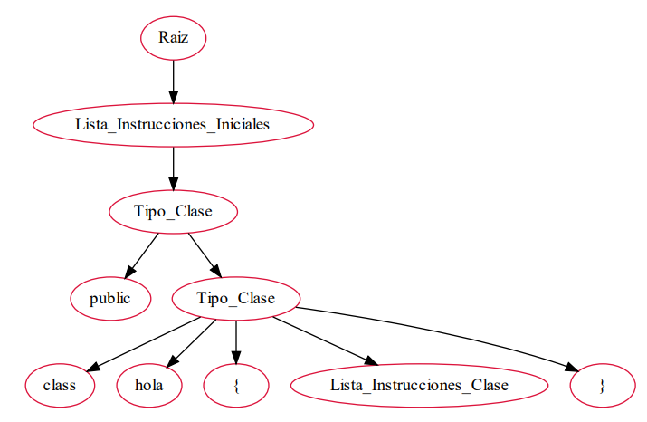
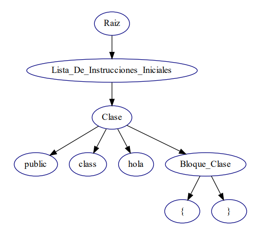

# Manual Técnico

#### Elaborado Por Sergio Alexander Echigoyen Gómez 201801628

La principal función de este programa es recibir como entrada un código fuente en java, que será analizado y luego traducido a dos lenguajes diferentes Python y JavaScript ambos analizadores fueron trabajados de manera independiente, uno por medio de una herramienta la cual fue jison y otro con el método de parea.

------------

### Diccionario De Directorios
1. Backend
2. Frontend

En el directorio Backend se encuentran los analizadores y el servidor de go que fue el encargado de servir la página HTML que sirve como interfaz gráfica para el usuario. Ambos analizadores fueron implementados haciendo uso de Javascript y Nodejs para servir los análisis.

En el directorio Frontend se encuentra la página HTML que sirve como interfaz gráfica para el usuario, así como todos los archivos necesarios para darle una mejor apariencia y funcionalidad.

------------

### Servidor Javascript

##### Diccionario De Archivos

1. Index.js En este archivo se encuentra el cuerpo del servidor.
2. Routesindex.js En este archivo se encuentra las rutas con los específicos endpoints que permiten acceder al servidor.
3. AnalizadorJison Dentro de este directorio se encuentra el analizador, este fue implementado con jison, hay dos archivos, .jison el cual contiene la gramática y el analizador, .js el cual contiene todo el código necesario que para hacer funcionar al analizador.
4. AnalizadorLexicoSintactico Dentro de este directorio se encuentra la clase abstracta llamada instrucción necesaria para el analizador y todas las subclases que heredan de la clase abstracta que representan cada instrucción individual, a continuación, se enumeran las clases

  - Asignación
  - Bloque
  - Clase
  - Comentarios
  - Declaración
  - Declaración For
  - Declaración Funciones
  - Do While
  - For
  - Funciones
  - If
  - Incremento Decremento
  - Interfaz
  - Lógicos
  - Matemáticos
  - Método Asignación
  - Método Declaración
  - Parámetros
  - Paréntesis
  - Primitivo
  - Print
  - Sentencias Ciclos
  - Sub Declaración
  - Variables Métodos
  - While

Además, dentro hay tres clases  Objetos que se utilizan para guardar tokens, errores, y nodos del Árbol Sintáctico.

### Servidor Python

##### Diccionario De Archivos

1. Index.js En este archivo se encuentra el cuerpo del servidor.
2. Routesindex.js En este archivo se encuentra las rutas con los específicos endpoints que permiten acceder al servidor.
3. AnalizadorLexicoScanner En este archivo se encuentra en analizador léxico, el cual se encarga de recibir flujo de caracteres, con el fin de verificar si todos son caracteres validos al lenguaje fuente en este caso java, de lo contrario los marca como errores léxicos
4. AnalizadorSintacticoParser En ese archivo se encuentra el analizador sintáctico implantado con el método de parea el cual recibe una lista de tokens previamente definidos por el analizador sintáctico, la cual se recorre verificado si los tokens actuales coinciden con los tokens esperados.
5. ArbolSintactico En este archivo se encuentra el método que genera el árbol sintáctico, para ese se reciclo el método de parea añadiendo en la mayoría de métodos un retorno de nodos árboles, los cuales son necesarios para generar el Árbol Sintáctico.
6. ObjetoArbol En este archivo se encuentra el modelo de un nodo del árbol sintáctico.
7. ObjetoError En este archivo se encuentra el modelo de un error.
8. ObjetoToken En este archivo se encuentra el modelo de un token.
9. Variables En este archivo se encuentra las variables globales y métodos que se utilizan alrededor de todo el proyecto.

### Servidor Go

##### Diccionario De Archivos

1. Index.html En este archivo se encuentra la estructura de la pagina web utilizada como interfaz gráfica para el cliente.
2. Style En este directorio se encuentran todos los archivos css que le dan estilo a la interfaz gráfica.
3. Script En este directorio se encuentra todos los archivos js que le dan funcionalidad al programa.

------------

#### Gramáticas

La gramática utilizada en el analizador realizado con Python es una gramática descendente recursivoa por la derecha, la cual fue implementada de la siguiente manera

Gramática Proyecto No.2

Organización De Lenguajes Y Compiladores No.1

Python

Sergio Alexander Echigoyen Gómez

201801628

Gramática Descendente Recursiva Por La Derecha

InicioAnalisis -&gt; InstruccionInicial ListaInstruccionesIniciales

ListaInstruccionesniciales -&gt; InstruccionInicial ListaInstruccionesIniciales
 Errores 
 Epsilon

InstruccionInicial -&gt; DefinicionTipoClase 
 DeclaracionVariables
 Comentarios 
 Error Sintactico

Mediante el árbol sintáctico se puede observar de mejor manera la forma de analizar

La gramática utilizada en el analizador realizado con JavaScript es una gramática Ascendente recursiva por la Izquierda, la cual fue implementada de la siguiente manera

Gramática Proyecto No.2

Organización De Lenguajes Y Compiladores No.1

JavaScript

Sergio Alexander Echigoyen Gómez

201801628

Gramática Ascendente Recursiva Por La Izquierda

InicioAnalisis  Instrucciones

Instrucciones  Instrucciones Instruccion

 Instruccion

Instruccion  Clase

 Interfaz

 Declaracion

 Comentarios

 ErroresSintacticos

Mediante el árbol sintáctico se puede observar de mejor manera la forma de analizar

------------

### Código 

Acontinuación se muestra un poco del codigo de la implementación de ambos analizadores

#### Analizador De Python

#### Analizador De  JavaScript

