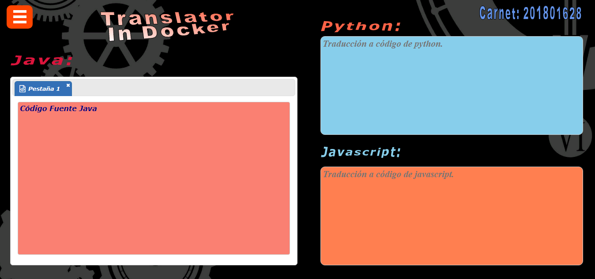
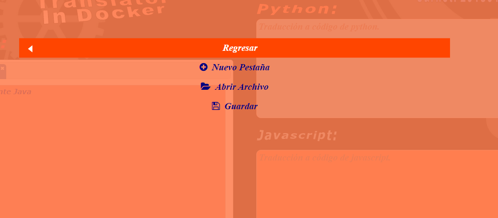
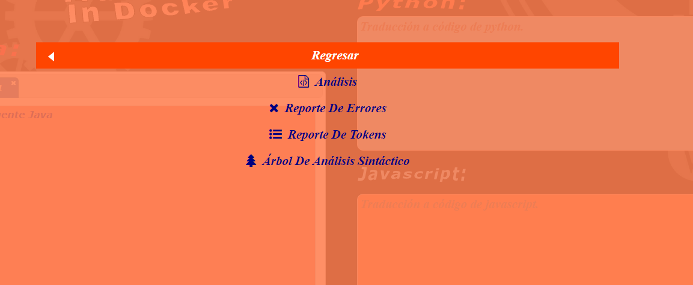
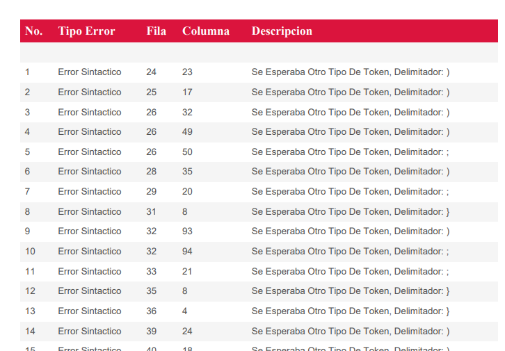
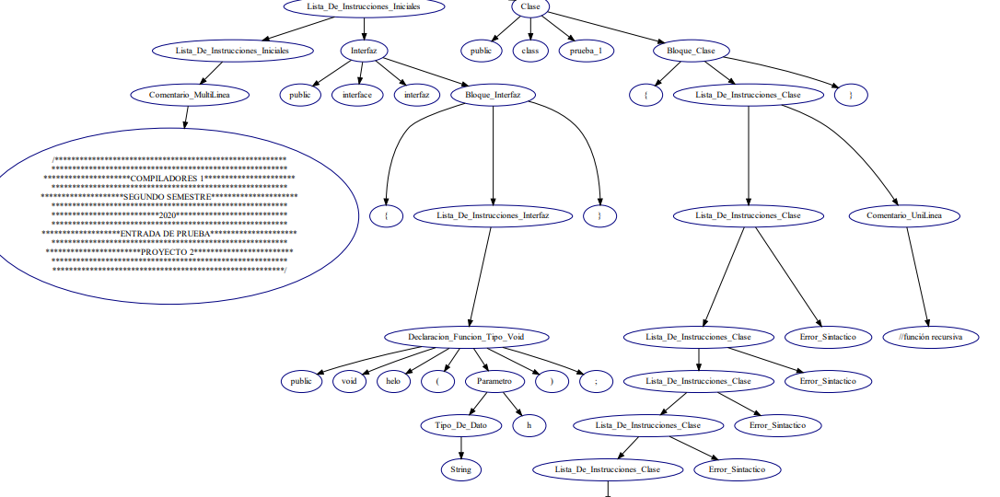
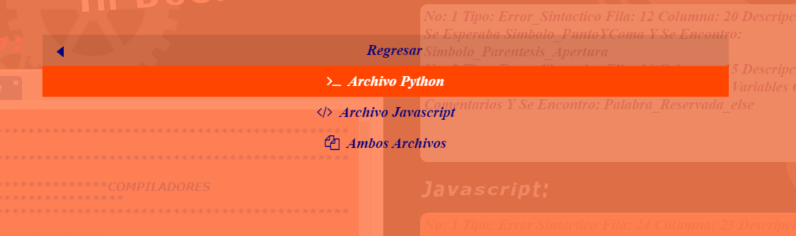
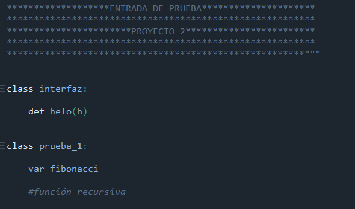
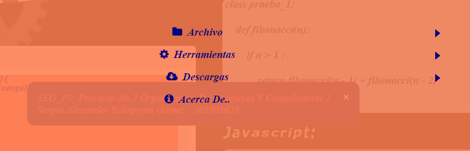
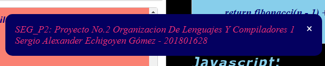
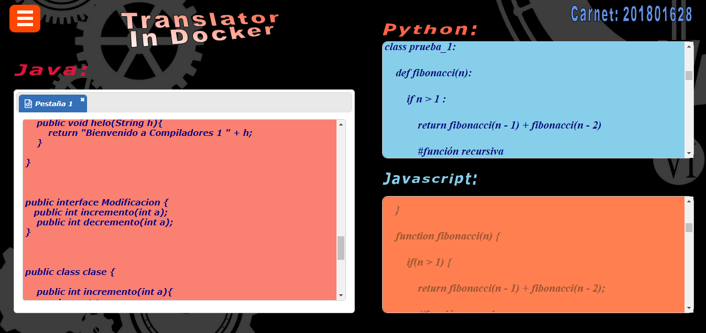

# **Manual Del Usuario**

------------

#### **Elaborado Por: Sergio Alexander Echigoyen Gómez 201801628**

##### Interfaz Gráfica:

### Menú Archivo:

------------

Este menú permite realizar operaciones basicas para su funcionamiento en nuestra interfaz

1. **Nueva Pestaña:** Este opción permite crear nuevas pestañas para poder abrir los archivos de entrada.

1. **Abrir Archivo:** Esta opción despliega un file chooser en el cual podemos seleccionar un archivo de extension java, el cual no servira para realizar los analisis y traducciones.

1. **Guardar:** Esta opción nos permite descargar un archivo con extension java el cual sera el archivo que se encuentre en la ultima pestaña activa.

### Menú Herramientas:

------------

Este menú se encarga de realizar todas las operaciones de los analizadores

1. **Análisis:** Esta opción realiza una peticion a ambos servidores para analizar el archivo previamente abierto .

1. **Reporte De Errores:** Esta opción realiza una petición a ambos servidores solicitando un reporte de errores en formato pdf, siempre y cuando previamente se haya realizado un analisis.

1. **Reporte De Tokens:** Esta opción realiza una petición a ambos servidores solicitando un reporte de Tokens en formato pdf, siempre y cuando previamente se haya realizado un analisis.

1. **Árbol De Análisis Sintactico:** Esta opción realiza una petición a ambos servidores solicitando un reporte en el cual se muestra la grafica del arbol sintactico.

### Menú Descarga:

------------

Este menú se encarga de descargar las traducciones que los analizadores dieron como respuesta.

1. **Archivo Python:** Esta opción permite descargar el archivo con la traduccion de Python.

1. **Archivo JavaScript: ** Esta opción permite descargar el archivo con la traduccion de JavaScript.

1. **Ambos Archivos:** Esta opción permite descargar ambos archivos con las traducciones.

### Menú Acerca De:

------------

Esta opción muestra un mensaje con los datos del programador de esta aplicación.

------------

De Esta manera se veria al realizar un análisis

